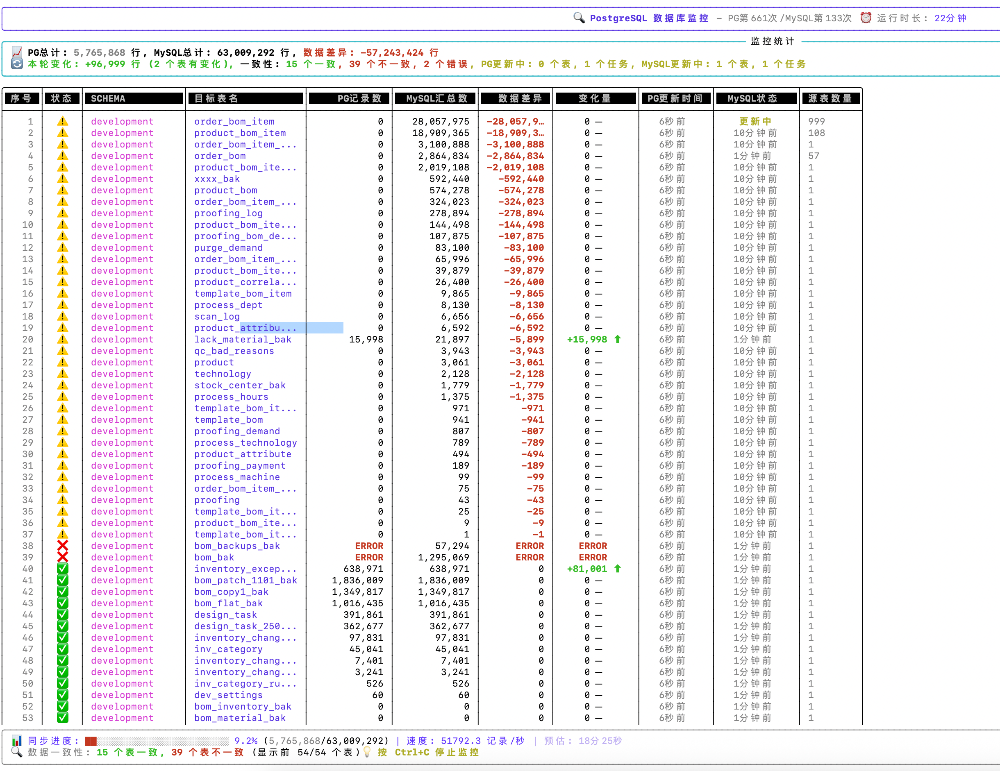

# MySQL vs MySQL 数据一致性监控工具

<div align="center">
  
  <p><em>实时MySQL与MySQL数据一致性监控界面</em></p>
</div>

一个专业的MySQL vs MySQL数据一致性监控工具，实时监控两个MySQL数据库之间的数据同步状态。该工具通过智能的表名映射和双数据库对比，帮助您快速发现和诊断数据同步过程中的一致性问题。

## ✨ 核心特性

### 🔍 智能监控
- **双频率更新**: 目标MySQL每次刷新，源MySQL按配置间隔更新（默认每3次目标更新触发1次源更新）
- **智能估算**: 首次启动使用`INFORMATION_SCHEMA`快速估算，后续使用精确COUNT查询
- **错误容错**: 查询失败时显示ERROR状态，不影响整体监控流程
- **异步更新**: 目标MySQL和源MySQL更新互不阻塞，提高监控效率

### 📊 表名映射系统
- **UUID格式处理**: 支持多种UUID格式后缀识别和映射
  - `table_8位-4位-4位-4位-12位` → `table`
  - `table_8位_4位_4位_4位_12位` → `table`  
  - `table_32位十六进制` → `table`
- **数字后缀映射**: `table_123456789` → `table`（9位数字）
- **时间后缀映射**: `table_123456789_2024` → `table`（数字_年份）
- **runtime后缀**: `table_runtime` → `table`
- **多源表汇总**: 多个MySQL源表可映射到同一MySQL目标表

### 🎨 Rich终端界面
- **实时更新**: 使用Rich Live组件实现无闪烁实时刷新
- **智能排序**: 数据不一致表优先显示，一致表按记录数排序
- **状态图标**: ✅一致 ⚠️不一致 ❌错误 
- **颜色编码**: 绿色增长、红色减少、黄色更新中
- **相对时间**: 智能显示秒/分钟/小时/天前的更新时间

### 📈 监控指标
- **记录数对比**: 目标MySQL与源MySQL精确记录数对比
- **变化追踪**: 实时显示目标MySQL记录数变化（增减量和趋势）
- **数据差异**: 计算并显示两个数据库间的数据差异
- **Schema统计**: 按数据库Schema分组的详细统计信息
- **源表统计**: 显示每个目标表对应的MySQL源表数量

## 🚀 快速开始

### 方法1: 一键启动（推荐）

```bash
./start_monitor.sh
```

该脚本自动完成：
- ✅ 检查并安装uv包管理器
- ✅ 安装项目依赖（使用`uv sync`）
- ✅ 启动监控程序

### 方法2: 手动安装

```bash
# 1. 安装uv包管理器
pip install uv

# 2. 安装依赖
uv sync

# 3. 启动监控
uv run cdc_monitor.py
```

### 方法3: 使用Python3直接运行

```bash
# 安装依赖
pip3 install rich psycopg2-binary PyMySQL configparser

# 运行程序  
python3 cdc_monitor.py
```

## ⚙️ 配置文件

### 配置文件格式 (config.ini)

```ini
[mysql]
host = localhost
port = 3306
databases = database1,database2,database3
username = root
password = your_password
ignored_table_prefixes = __spliting_,__temp_,__backup_

[mysql_target]
host = localhost
port = 3307
databases = target_database1,target_database2
username = root
password = your_password
ignored_table_prefixes = __spliting_,__temp_,__backup_
```

[monitor]
refresh_interval = 2
max_tables_display = 100
enable_clear_screen = true
mysql_update_interval = 3
```

### 配置参数详解

| 参数 | 说明 | 默认值 | 备注 |
|------|------|---------|-------|
| `refresh_interval` | 目标MySQL数据刷新间隔（秒） | 3 | 每次刷新都会更新目标数据 |
| `mysql_update_interval` | 源MySQL更新间隔（目标更新次数） | 3 | 每3次目标更新触发1次源更新 |
| `max_tables_display` | 最大显示表数量 | 50 | 限制界面显示的表数量 |
| `enable_clear_screen` | 是否清屏刷新 | true | 控制界面刷新方式 |
| `ignored_table_prefixes` | 忽略的表前缀 | - | 逗号分隔的前缀列表 |
| `databases` | MySQL数据库列表 | - | 逗号分隔的数据库名称 |

## 📊 界面说明

### 监控界面组成

1. **标题栏**: 显示程序名称、PG更新次数、MySQL更新次数、程序运行时长
2. **统计面板**: 
   - 表数量和Schema统计
   - 数据量统计（PG总计、MySQL总计、差异）
   - 变化统计（变化量、一致性状态）
   - 多Schema时显示详细分组统计
3. **数据表格**: 按优先级排序的表详细信息
4. **状态说明**: 图标含义和操作提示

### 表格列说明

| 列名 | 说明 | 示例 |
|------|------|------|
| **序号** | 表序号 | 1, 2, 3... |
| **状态** | 表状态图标 | ✅ ⚠️ ❌ |
| **SCHEMA** | 源MySQL数据库名称 | hr, finance |
| **目标表名** | 目标MySQL中的表名 | employee, order |
| **目标记录数** | 目标MySQL表记录数 | 1,234,567 或 ~1,234,567 |
| **源汇总数** | 源MySQL表记录数汇总 | 1,234,560 或 ~1,234,560 |
| **数据差异** | 目标与源的差异 | +7, -3, 0 |
| **变化量** | 目标记录数变化 | +100⬆, -50⬇, 0─ |
| **目标更新时间** | 目标MySQL数据更新时间 | 3秒前, 2分钟前 |
| **源状态** | 源MySQL数据同步状态 | 5分钟前, 更新中, 未更新 |
| **源表数量** | 源MySQL表数量 | 1, 3, 5 |

### 状态图标含义

| 图标 | 含义 | 触发条件 |
|------|------|----------|
| ✅ | 数据一致 | PG记录数 = MySQL记录数 |
| ⚠️ | 数据不一致 | PG记录数 ≠ MySQL记录数 |
| ❌ | 查询错误 | 数据库查询失败（显示ERROR） |

### 颜色编码系统

| 颜色 | 用途 | 说明 |
|------|------|------|
| 🟢 绿色 | 正常/增长 | 数据增长、更新成功、一致状态 |
| 🔴 红色 | 异常/减少 | 数据减少、错误状态、不一致 |
| 🟡 黄色 | 进行中 | MySQL更新中、处理状态 |
| ⚪ 白色 | 无变化 | 数据无变化、中性状态 |

## 🔧 表名映射规则详解

程序实现了复杂的表名映射算法，支持以下映射规则：

### 1. Runtime后缀映射
```
employee_runtime → employee
order_detail_runtime → order_detail
```

### 2. 9位数字后缀映射
```
user_table_123456789 → user_table
product_333367878 → product
```

### 3. 数字+年份后缀映射
```
order_bom_item_333367878_2018 → order_bom_item
sales_data_123456789_2024 → sales_data
```

### 4. UUID格式映射

#### 下划线分隔UUID (8_4_4_4_12)
```
order_bom_0e9b60a4_d6ed_473d_a326_9e8c8f744ec2 → order_bom
user_profile_1a2b3c4d_5e6f_7890_abcd_ef1234567890 → user_profile
```

#### 连字符分隔UUID (8-4-4-4-12)
```
users_a1b2c3d4-e5f6-7890-abcd-ef1234567890 → users
products_12345678-90ab-cdef-1234-567890abcdef → products
```

#### UUID+年份格式
```
order_bom_item_05355967_c503_4a2d_9dd1_2dd7a9ffa15e_2030 → order_bom_item
```

#### 32位十六进制UUID
```
accounts_1a2b3c4d5e6f7890abcdef1234567890 → accounts
```

### 映射示例
一个目标MySQL表可能对应多个源MySQL表：
```
目标MySQL: employee (目标表)
    ← 源MySQL: employee_runtime
    ← 源MySQL: employee_123456789  
    ← 源MySQL: employee_uuid_format
    ← 源MySQL: employee_backup_2024
```

## 📋 系统要求

- **Python版本**: 3.8.1+
- **操作系统**: Linux, macOS, Windows
- **内存要求**: 建议512MB以上
- **网络要求**: 能够访问两个MySQL数据库

### 依赖包
```toml
dependencies = [
    "rich>=13.0.0",           # 终端界面库
    "aiomysql>=0.2.0",        # 异步MySQL驱动
    "configparser>=5.0.0"     # 配置文件解析
]
```

## 🎯 典型使用场景

### 1. MySQL数据同步监控
- 监控MySQL到MySQL的数据同步状态
- 实时发现数据同步延迟或失败
- 验证双MySQL环境的数据一致性

### 2. MySQL数据迁移验证
- 验证MySQL到MySQL的数据迁移完整性
- 对比迁移前后的数据量差异
- 监控迁移过程中的数据变化

### 3. MySQL双活系统监控
- 监控MySQL双活系统中两个数据库的一致性
- 发现数据不同步的表和记录
- 提供数据修复的依据

### 4. MySQL数据质量检测
- 定期检查MySQL数据质量
- 发现源与目标数据库的差异
- 建立MySQL数据质量监控体系

## ⌨️ 操作说明

### 启动程序
```bash
# 一键启动
./start_monitor.sh

# 或手动启动
uv run cdc_monitor.py
```

### 停止程序
- 按 `Ctrl+C` 优雅停止
- 按 `Ctrl+Z` 暂停（可用`fg`恢复）

### 查看日志
程序输出实时显示在终端，包括：
- 数据库连接状态
- 表结构初始化进度
- 数据更新状态
- 错误信息和警告

## 🔍 故障排除

### 数据库连接问题

#### 目标MySQL连接失败
```bash
# 检查连接
mysql -h host -P port -u username -p

# 常见问题
1. 检查MySQL服务状态
2. 验证用户权限和密码
3. 确认数据库存在
4. 检查字符集设置
```

#### 源MySQL连接失败
```bash
# 检查连接
mysql -h host -P port -u username -p

# 常见问题  
1. 检查MySQL服务状态
2. 验证用户权限和密码
3. 确认数据库存在
4. 检查字符集设置
```

### 权限问题

#### 目标MySQL需要的权限
```sql
-- 查询系统表权限
GRANT SELECT ON INFORMATION_SCHEMA.TABLES TO 'monitor_user'@'%';
GRANT SELECT ON INFORMATION_SCHEMA.STATISTICS TO 'monitor_user'@'%';

-- 查询用户表权限
GRANT SELECT ON target_database.* TO 'monitor_user'@'%';
```

#### 源MySQL需要的权限
```sql
-- 基本查询权限
GRANT SELECT ON source_database.* TO 'monitor_user'@'%';

-- INFORMATION_SCHEMA权限
GRANT SELECT ON INFORMATION_SCHEMA.TABLES TO 'monitor_user'@'%';
```

### 性能优化

#### 大表处理
- 程序自动使用统计信息进行估算（显示~符号）
- 可通过`ignored_table_prefixes`忽略不重要的表
- 适当调整`mysql_update_interval`减少MySQL查询频率

#### 网络优化
- 将程序部署在靠近数据库的网络环境
- 使用数据库连接池（程序内置连接复用）
- 适当增加`refresh_interval`降低网络压力

### 常见错误排查

| 错误类型 | 可能原因 | 解决方案 |
|----------|----------|----------|
| `Connection refused` | 数据库未启动/端口被占用 | 检查数据库服务和端口 |
| `Authentication failed` | 用户名密码错误 | 验证配置文件中的认证信息 |
| `Permission denied` | 用户权限不足 | 授予必要的SELECT权限 |
| `Table not found` | 表不存在或权限不足 | 检查表名和访问权限 |
| `Timeout` | 网络超时或查询太慢 | 检查网络连接和数据库性能 |
| `ERROR in display` | 查询执行失败 | 查看具体错误信息，检查SQL语法 |

## 📁 项目结构

```
mysql-migration-monitor/
├── cdc_monitor.py         # 主监控程序 (MySQL vs MySQL)
│   ├── DatabaseConfig     # 数据库配置类
│   ├── MySQLConfig        # MySQL专用配置类  
│   ├── TableInfo         # 表信息数据类
│   ├── SyncProperties    # 表名映射规则类
│   └── MonitorApp        # 主监控器类
├── config.ini            # 配置文件
├── start_monitor.sh      # 一键启动脚本
├── test_mysql_monitor.py # 测试脚本
├── pyproject.toml        # 项目配置和依赖
├── uv.lock              # 依赖锁定文件
├── images/              # 截图资源目录
│   └── monitor-interface.png
└── README.md            # 项目说明文档
```

### 核心类说明

- **DatabaseConfig**: 基础数据库配置
- **MySQLConfig**: MySQL配置，支持多数据库和表过滤
- **TableInfo**: 表信息封装，包含数据量、变化、时间等
- **SyncProperties**: 复杂的表名映射算法实现
- **MonitorApp**: 主监控逻辑，包含界面创建和数据更新

## 🤝 贡献指南

欢迎提交Issue和Pull Request！

### 开发环境搭建
```bash
# 克隆项目
git clone your-repo-url
cd flink-cdc-monitor

# 安装开发依赖
uv sync --dev

# 运行测试
uv run pytest

# 代码格式化
uv run black cdc_monitor.py
uv run flake8 cdc_monitor.py
```

### 提交流程
1. Fork 项目到你的GitHub
2. 创建特性分支 (`git checkout -b feature/新功能`)
3. 提交更改 (`git commit -m '添加新功能'`)
4. 推送分支 (`git push origin feature/新功能`)
5. 创建Pull Request

## 📄 许可证

本项目基于 MIT 许可证开源 - 查看 [LICENSE](LICENSE) 文件了解详情。

## 📞 技术支持

### 获取帮助
1. 📖 查看本文档的故障排除部分
2. 🔍 搜索已有的 [Issues](../../issues)
3. 💬 创建新Issue并提供详细信息：
   - 操作系统和Python版本
   - 完整的错误信息
   - 配置文件内容（隐去敏感信息）
   - 复现步骤

### 反馈和建议
- 🐛 Bug报告：使用Issue模板
- 💡 功能建议：详细描述使用场景
- 📚 文档改进：直接提交PR

---

<div align="center">
  <p>⭐ 如果这个项目对你有帮助，请给个星标支持一下！</p>
  <p>🔧 持续更新中，欢迎关注项目动态</p>
</div> 